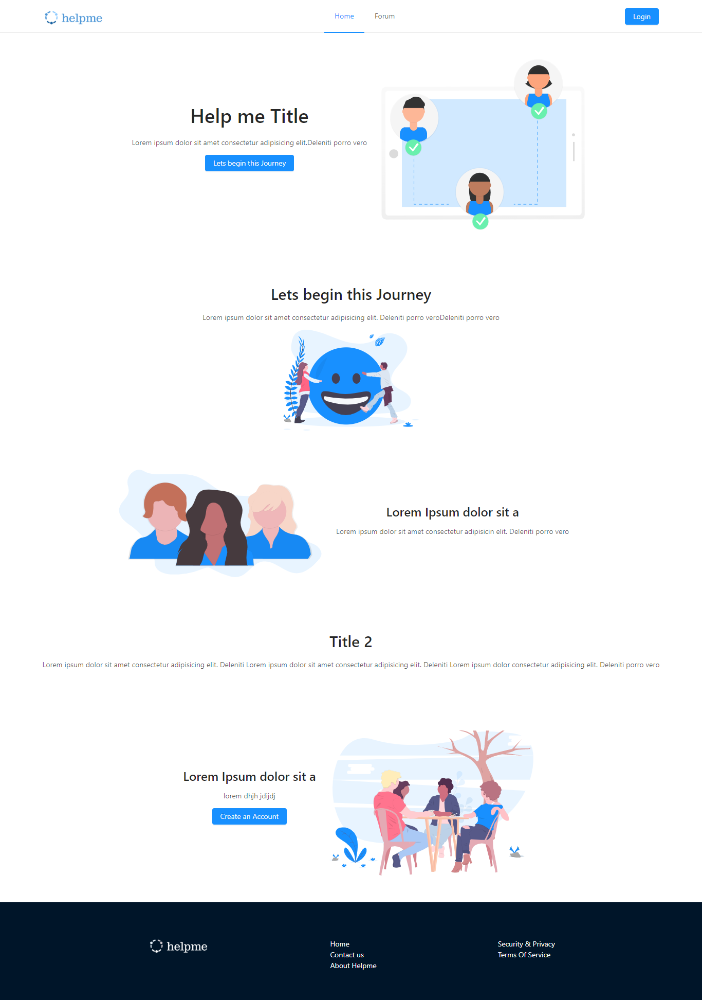

# Project Help Me

Help Me is an app that connects Depressed people to each other, essentially, it is a social network for depressed people where affected individuals can connect to seek help and therapy.

## Development

- Clone this repo to your local machine using `git clone https://github.com/team-helpme/helpme`
- `cd helpme`
- `npm install`
- `npm run dev`

Antdesign is also used for the components, check <http://ant.design/docs/react/introduce>
